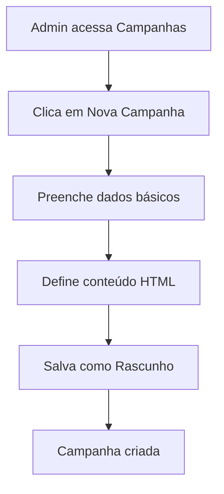
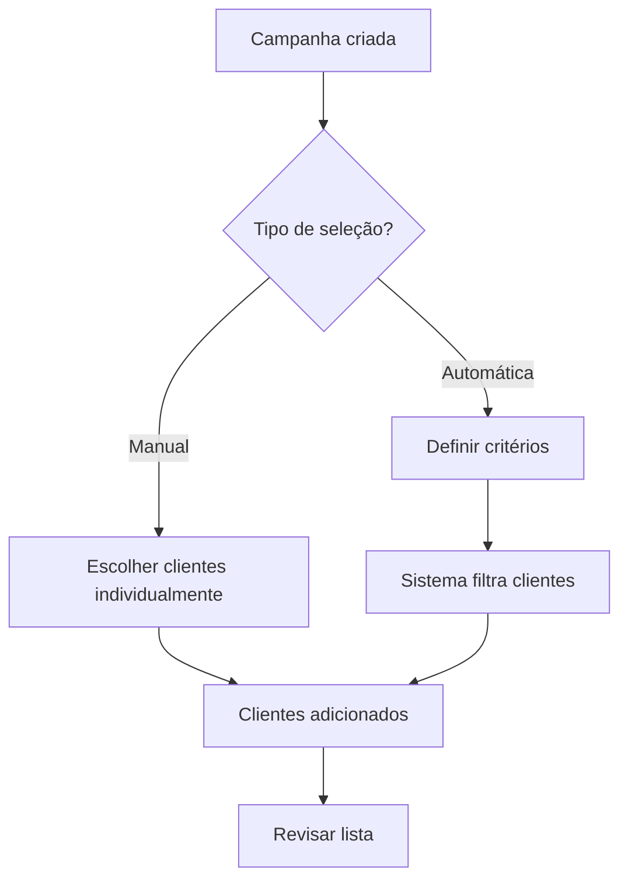
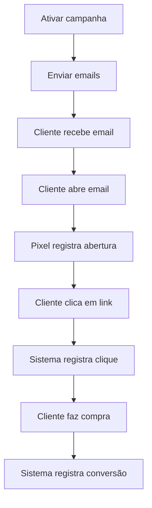

# 📧 Sistema de Campanhas de Marketing

O sistema de campanhas permite criar, gerenciar e acompanhar campanhas de marketing por email com rastreamento avançado de métricas.

## 📋 Índice

- [Visão Geral](#visão-geral)
- [Funcionalidades](#funcionalidades)
- [Fluxo de Trabalho](#fluxo-de-trabalho)
- [Criando uma Campanha](#criando-uma-campanha)
- [Segmentação de Clientes](#segmentação-de-clientes)
- [Rastreamento e Métricas](#rastreamento-e-métricas)
- [Templates de Email](#templates-de-email)
- [Integração com Fidelidade](#integração-com-fidelidade)
- [API e Webhooks](#api-e-webhooks)
- [Melhores Práticas](#melhores-práticas)

---

## 🎯 Visão Geral

O sistema de campanhas é uma ferramenta completa de email marketing que permite:

- **Criar campanhas personalizadas** com conteúdo HTML
- **Segmentar clientes** por critérios específicos
- **Rastrear métricas** de abertura, cliques e conversões
- **Distribuir pontos de fidelidade** para participantes
- **Automatizar o envio** de emails em massa

### Arquitetura do Sistema

```
┌─────────────────┐    ┌─────────────────┐    ┌─────────────────┐
│   Campaign      │    │  CampaignMail   │    │ CampaignService │
│   Controller    │───▶│   (Mailable)    │───▶│   (Business)    │
└─────────────────┘    └─────────────────┘    └─────────────────┘
         │                        │                        │
         ▼                        ▼                        ▼
┌─────────────────┐    ┌─────────────────┐    ┌─────────────────┐
│   Campaign      │    │  Email Template │    │ CampaignTracking│
│   Model         │    │   (Blade View)  │    │   Controller    │
└─────────────────┘    └─────────────────┘    └─────────────────┘
```

---

## ⚡ Funcionalidades

### 📊 Gestão de Campanhas

- ✅ **CRUD Completo** - Criar, visualizar, editar e excluir
- ✅ **Status Management** - Rascunho, Ativa, Concluída, Cancelada
- ✅ **Agendamento** - Data de início e fim
- ✅ **Tipos** - Email, SMS (futuro), Push (futuro)

### 🎯 Segmentação Avançada

- ✅ **Seleção Manual** - Escolher clientes individualmente
- ✅ **Seleção Automática** - Por critérios definidos
- ✅ **Critérios Disponíveis**:
  - Número mínimo de compras
  - Valor total gasto
  - Categorias de livros preferidas
  - Dias desde a última compra

### 📈 Métricas e Rastreamento

- ✅ **Abertura de Emails** - Pixel de rastreamento invisível
- ✅ **Cliques em Links** - Redirecionamento rastreado
- ✅ **Conversões** - Compras após campanha
- ✅ **Relatórios** - Dashboard com taxas e gráficos

### 🎁 Integração com Fidelidade

- ✅ **Distribuição de Pontos** - Para participantes da campanha
- ✅ **Incentivos** - Recompensar engajamento
- ✅ **Histórico** - Rastrear pontos distribuídos

---

## 🔄 Fluxo de Trabalho

### 1. Criação da Campanha



### 2. Seleção de Clientes



### 3. Envio e Rastreamento



---

## 🚀 Criando uma Campanha

### Passo a Passo

1. **Acessar o Sistema**
   ```
   Dashboard > Marketing > Campanhas > Nova Campanha
   ```

2. **Dados Básicos**
   ```php
   Nome: "Promoção Black Friday 2025"
   Tipo: "Email"
   Descrição: "Descontos especiais para Black Friday"
   Data de Início: "2025-11-25 00:00"
   Data de Término: "2025-11-30 23:59"
   ```

3. **Conteúdo da Campanha**
   ```html
   <h2>🔥 Black Friday - Até 50% OFF!</h2>
   <p>Olá {{customer_name}},</p>
   <p>Aproveite nossa <strong>super promoção</strong> de Black Friday!</p>
   
   <div style="text-align: center; margin: 20px 0;">
       <a href="https://livraria.com/promocoes" 
          style="background: #ff6b35; color: white; padding: 15px 30px; 
                 text-decoration: none; border-radius: 5px;">
           🛒 Ver Ofertas
       </a>
   </div>
   
   <p>Válido até 30/11/2025. Não perca!</p>
   ```

4. **Critérios de Segmentação** (Opcional)
   ```json
   {
     "min_purchases": 2,
     "min_total_spent": 100.00,
     "categories": [1, 2, 3],
     "days_since_last_purchase": 30
   }
   ```

### Campos Obrigatórios

| Campo | Tipo | Descrição |
|-------|------|-----------|
| `name` | String | Nome da campanha |
| `type` | Enum | Tipo (email, sms, push) |
| `content` | HTML | Conteúdo da campanha |
| `start_date` | DateTime | Data de início |

### Campos Opcionais

| Campo | Tipo | Descrição |
|-------|------|-----------|
| `description` | Text | Descrição detalhada |
| `end_date` | DateTime | Data de término |
| `target_criteria` | JSON | Critérios de segmentação |

---

## 🎯 Segmentação de Clientes

### Seleção Manual

1. Acesse a campanha criada
2. Clique em "Adicionar Clientes"
3. Selecione clientes da lista
4. Confirme a seleção

### Seleção Automática

Configure critérios para filtrar clientes automaticamente:

#### Por Comportamento de Compra

```php
// Clientes que compraram pelo menos 3 vezes
'min_purchases' => 3

// Clientes que gastaram pelo menos R$ 200
'min_total_spent' => 200.00
```

#### Por Preferências

```php
// Clientes que compram livros de Ficção (ID 1) ou Romance (ID 2)
'categories' => [1, 2]
```

#### Por Recência

```php
// Clientes que compraram nos últimos 60 dias
'days_since_last_purchase' => 60
```

### Exemplo Completo

```php
$criteria = [
    'min_purchases' => 2,           // Pelo menos 2 compras
    'min_total_spent' => 150.00,    // Gastou pelo menos R$ 150
    'categories' => [1, 3, 5],      // Gosta de Ficção, Fantasia ou Autoajuda
    'days_since_last_purchase' => 90 // Comprou nos últimos 3 meses
];
```

---

## 📊 Rastreamento e Métricas

### Métricas Coletadas

| Métrica | Descrição | Como é Medida |
|---------|-----------|---------------|
| **Enviados** | Emails enviados com sucesso | Confirmação do servidor SMTP |
| **Abertos** | Emails abertos pelo cliente | Pixel de rastreamento 1x1 |
| **Clicados** | Links clicados no email | Redirecionamento rastreado |
| **Convertidos** | Compras após a campanha | Webhook de conversão |

### Dashboard de Métricas

```
┌─────────────────────────────────────────────────────────┐
│                  Métricas da Campanha                   │
├─────────────────┬─────────────────┬─────────────────────┤
│ Clientes Alvo   │ Emails Enviados │ Emails Abertos      │
│      1,250      │    1,200 (96%)  │     480 (40%)       │
├─────────────────┼─────────────────┼─────────────────────┤
│ Links Clicados  │ Conversões      │ ROI                 │
│     120 (10%)   │     24 (2%)     │     R$ 2,400        │
└─────────────────┴─────────────────┴─────────────────────┘
```

### Cálculo das Taxas

```php
// Taxa de Abertura
$openRate = ($opened / $sent) * 100;

// Taxa de Clique
$clickRate = ($clicked / $sent) * 100;

// Taxa de Conversão
$conversionRate = ($converted / $sent) * 100;

// ROI (Return on Investment)
$roi = $totalRevenue - $campaignCost;
```

### Rastreamento Técnico

#### Pixel de Abertura

```html
<!-- Inserido automaticamente no email -->

```

#### Links Rastreados

```html
<!-- Link original -->
<a href="https://livraria.com/promocoes">Ver Ofertas</a>

<!-- Link rastreado (automático) -->
<a href="https://livraria.com/track/click/{campaign_id}/{customer_id}/{token}?url=https%3A//livraria.com/promocoes">
    Ver Ofertas
</a>
```

---

## 📧 Templates de Email

### Estrutura do Template

O template padrão inclui:

```html
<!DOCTYPE html>
<html lang="pt-BR">
<head>
    <meta charset="UTF-8">
    <meta name="viewport" content="width=device-width, initial-scale=1.0">
    <title>{{ $campaign->name }}</title>
    <style>
        /* Estilos responsivos */
        body { font-family: Arial, sans-serif; max-width: 600px; margin: 0 auto; }
        .header { text-align: center; padding: 20px 0; border-bottom: 1px solid #eee; }
        .content { padding: 20px 0; }
        .footer { text-align: center; font-size: 12px; color: #777; }
        .button { background-color: #3490dc; color: white; padding: 10px 20px; }
    </style>
</head>
<body>
    <div class="header">
        
        <h1>{{ $campaign->name }}</h1>
    </div>
    
    <div class="content">
        <p>Olá <strong>{{ $customer->name }}</strong>,</p>
        {!! $content !!}
    </div>
    
    <div class="footer">
        <p>© {{ date('Y') }} Livraria CRM. Todos os direitos reservados.</p>
        <p><a href="#">Cancelar inscrição</a></p>
    </div>
    
    <!-- Pixel de rastreamento -->
    
</body>
</html>
```

### Variáveis Disponíveis

| Variável | Descrição | Exemplo |
|----------|-----------|---------|
| `$campaign->name` | Nome da campanha | "Black Friday 2025" |
| `$customer->name` | Nome do cliente | "João Silva" |
| `$customer->email` | Email do cliente | "joao@email.com" |
| `$content` | Conteúdo da campanha | HTML personalizado |
| `$trackingPixel` | URL do pixel | URL de rastreamento |

### Personalização

```html
<!-- Usar dados do cliente -->
<p>Olá {{ $customer->name }},</p>

<!-- Condicional baseada em dados -->
@if($customer->loyaltyPoints > 1000)
    <p>Como cliente VIP, você tem <strong>desconto extra de 10%</strong>!</p>
@endif

<!-- Links personalizados -->
<a href="{{ url('/cliente/dashboard') }}">Acessar Minha Conta</a>
```

---

## 🎁 Integração com Fidelidade

### Distribuir Pontos

1. **Acesse a campanha**
2. **Vá para "Programa de Fidelidade"**
3. **Configure os pontos**:
   ```
   Pontos a Distribuir: 100
   Descrição: "Pontos bônus - Campanha Black Friday"
   ```
4. **Clique em "Distribuir Pontos"**

### Critérios para Distribuição

```php
// Distribuir apenas para clientes que abriram o email
$campaign->customers()
    ->wherePivot('opened', true)
    ->each(function($customer) {
        $loyaltyService->addPoints($customer->id, 50, 'Campanha Black Friday');
    });

// Distribuir mais pontos para quem clicou
$campaign->customers()
    ->wherePivot('clicked', true)
    ->each(function($customer) {
        $loyaltyService->addPoints($customer->id, 100, 'Engajamento - Black Friday');
    });
```

### Histórico de Pontos

Os pontos distribuídos ficam registrados em:

- **Tabela `loyalty_transactions`** - Histórico individual
- **Pivot `campaign_customer`** - Relacionamento campanha-cliente
- **Métricas da campanha** - Totais distribuídos

---

## 🔌 API e Webhooks

### Endpoints da API

#### Rastreamento de Abertura

```http
GET /track/open/{campaign_id}/{customer_id}/{token}
```

**Resposta**: Pixel transparente 1x1 (GIF)

#### Rastreamento de Clique

```http
GET /track/click/{campaign_id}/{customer_id}/{token}?url={encoded_url}
```

**Resposta**: Redirecionamento para URL original

#### Rastreamento de Conversão

```http
POST /track/conversion/{campaign_id}/{customer_id}/{token}
```

**Resposta**: 
```json
{
    "success": true,
    "message": "Conversão registrada"
}
```

### Webhooks

Configure webhooks para receber notificações:

```php
// Webhook de conversão (exemplo)
Route::post('/webhook/campaign-conversion', function(Request $request) {
    $campaignId = $request->input('campaign_id');
    $customerId = $request->input('customer_id');
    $revenue = $request->input('revenue');
    
    // Registrar conversão
    $campaignService->trackConversion($campaignId, $customerId, $revenue);
    
    return response()->json(['status' => 'success']);
});
```

### Segurança

Todos os links de rastreamento incluem token de segurança:

```php
$token = md5($campaign->id . $customer->id . $customer->email);
```

---

## 💡 Melhores Práticas

### 📝 Criação de Conteúdo

1. **Assunto Atraente**
   - ✅ "🔥 50% OFF em todos os livros - Só hoje!"
   - ❌ "Promoção de livros"

2. **Personalização**
   - ✅ Use o nome do cliente
   - ✅ Referencie compras anteriores
   - ✅ Segmente por interesses

3. **Call-to-Action Claro**
   - ✅ Botões grandes e coloridos
   - ✅ Texto de ação específico
   - ✅ Senso de urgência

### 🎯 Segmentação Eficaz

1. **Clientes Ativos** (compraram nos últimos 90 dias)
   ```php
   'days_since_last_purchase' => 90
   ```

2. **Clientes VIP** (gastaram mais de R$ 500)
   ```php
   'min_total_spent' => 500.00
   ```

3. **Por Categoria** (fãs de ficção científica)
   ```php
   'categories' => [1] // ID da categoria Ficção Científica
   ```

### 📊 Otimização de Métricas

1. **Taxa de Abertura** (Meta: >25%)
   - Teste diferentes assuntos
   - Evite palavras que ativam spam
   - Envie no horário ideal (10h-14h)

2. **Taxa de Clique** (Meta: >5%)
   - Use botões em vez de links
   - Teste posicionamento dos CTAs
   - Ofereça valor real

3. **Taxa de Conversão** (Meta: >2%)
   - Landing pages otimizadas
   - Ofertas relevantes
   - Processo de compra simples

### 🚀 Performance

1. **Envio em Lotes**
   ```php
   // Enviar em grupos de 100
   $campaign->customers()->chunk(100, function($customers) {
       foreach($customers as $customer) {
           Mail::to($customer->email)->send(new CampaignMail($campaign, $customer));
       }
   });
   ```

2. **Filas Assíncronas**
   ```php
   // Usar filas para envios grandes
   class CampaignMail extends Mailable implements ShouldQueue
   {
       use Queueable, SerializesModels;
   }
   ```

3. **Cache de Métricas**
   ```php
   // Cache métricas por 1 hora
   $metrics = Cache::remember("campaign_metrics_{$campaignId}", 3600, function() {
       return $this->calculateMetrics($campaignId);
   });
   ```

---

## 🔧 Troubleshooting

### Problemas Comuns

#### Emails não são enviados

1. **Verificar configuração SMTP** no `.env`
2. **Checar filas**: `php artisan queue:work`
3. **Ver logs**: `storage/logs/laravel.log`

#### Rastreamento não funciona

1. **Verificar URLs** de rastreamento
2. **Confirmar tokens** de segurança
3. **Testar endpoints** manualmente

#### Métricas incorretas

1. **Limpar cache**: `php artisan cache:clear`
2. **Reprocessar dados** da campanha
3. **Verificar timestamps** dos eventos

### Comandos Úteis

```bash
# Ver status das filas
php artisan queue:monitor

# Processar filas manualmente
php artisan queue:work --once

# Limpar emails com falha
php artisan queue:flush

# Ver métricas de uma campanha
php artisan tinker
>>> App\Models\Campaign::find(1)->getOpenRate()
```

---

## 📈 Métricas de Benchmark

### Taxas Médias da Indústria

| Métrica | E-commerce | Livrarias | Meta CRM |
|---------|------------|-----------|----------|
| **Taxa de Abertura** | 18-25% | 20-28% | >25% |
| **Taxa de Clique** | 2-5% | 3-7% | >5% |
| **Taxa de Conversão** | 1-3% | 1-4% | >2% |
| **Taxa de Descadastro** | <0.5% | <0.3% | <0.2% |

### ROI Esperado

- **Campanha Básica**: 3:1 (R$ 3 de retorno para cada R$ 1 investido)
- **Campanha Segmentada**: 5:1
- **Campanha Personalizada**: 8:1

---

## 🔮 Roadmap Futuro

### Funcionalidades Planejadas

- [ ] **A/B Testing** - Testar diferentes versões
- [ ] **Automação** - Campanhas baseadas em gatilhos
- [ ] **SMS Marketing** - Campanhas por SMS
- [ ] **Push Notifications** - Notificações web/mobile
- [ ] **Integração WhatsApp** - Campanhas via WhatsApp
- [ ] **Machine Learning** - Otimização automática
- [ ] **Templates Avançados** - Editor drag-and-drop

### Melhorias Técnicas

- [ ] **Rate Limiting** - Controle de envio
- [ ] **Deliverability** - Melhoria na entregabilidade
- [ ] **Analytics Avançado** - Métricas mais detalhadas
- [ ] **API GraphQL** - API mais flexível
- [ ] **Webhooks Bidirecionais** - Integração completa

---

**Última atualização**: Novembro 2025  
**Versão**: 2.0.0  
**Autor**: Equipe CRM Livraria
